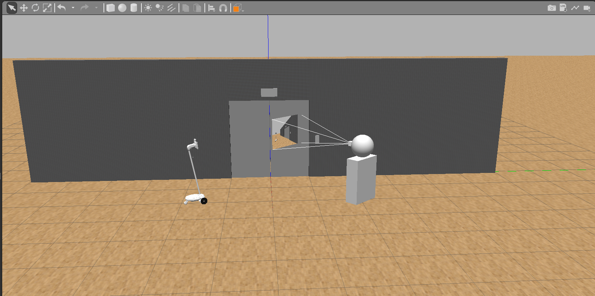

# Mobile Robotic Telepresence Norms Paper Simulations
This repository contains code used to generate human-MRP interactions in Gazebo. The MRP is a model of the OhmniLabs telepresence robot and the human has been created using Gazebo 3D models. The OhmniLabs robot is based on the repository provided by OhmniLabs [here](https://gitlab.com/ohmni-sdk/tb_gazebo_model)]



## Prerequisites
* Ubuntu 18.04
* [ROS Melodic](http://wiki.ros.org/melodic/Installation/Ubuntu) : recommend install ros-melodic-desktop-full
* [Gazebo 9.10.0](http://gazebosim.org/tutorials?tut=install_ubuntu&cat=install#Defaultinstallation:one-liner): Or you could use the default installed version (9.0.0) with the above ROS install. 
* A graphics card to support graphic rendering. The OhmniLabs developer used NVIDIA Quadro M2200, enough to run this simulation smoothly. I used Intel(R) HD Graphics 620 and obtained a Gazebo timefactor of 0.3.

## Installation
Open terminal and clone repository

```
~..$  git clone https://github.com/cclin130/mrp-norms.git mrp-norms
```
Install with catkin_make
```
~..$ cd mrp-norms/ros_ws
~../mrp-norms/ros_ws$ catkin_make 
```

Note that, during installation, these may be some errors caused by missing packages, please install it with **apt** and report the issue if you found any.

Potential missing packages:
```
~$ sudo apt install ros-melodic-gazebo-plugins ros-melodic-rqt-robot-steering ros-melodic-rviz-imu-plugin ros-melodic-joint-state-publisher-gui
```
## Basic Usage

Before running the simulation, setup your development environment from the main directory of the repository.
```
~../mrp-norms/ros_ws$ source setup.sh
```

To run the simulation, you need both Gazebo/RViz and Jupyter notebook to be running.

Start Gazebo and RViz
```
roslaunch elevator elevator_interaction.launch
```
Start Jupyter Notebook
```
jupyter notebook
```

Once Jupyter notebook launches, open the `Human-MRP Interaction Scenario Animations.ipynb` notebook and run the code in the cells.

You can also test your development setup with the sample Gazebo worlds provided by Ohmni:
```
### empty world
~../mrp-norms/ros_ws$ roslaunch gazebo_environment empty.launch

### or run with office models 
~../mrp-norms/ros_ws$ roslaunch gazebo_environment testbed_kolvn_office.launch
~../mrp-norms/ros_ws$ roslaunch gazebo_environment willowgarage.launch
```
Use Rviz to visualize sensor data. You can control robot speed (linear and angular) with ROS Topic `/tb_cmd_vel`, and robot neck position with ROS Topic `/tb_sim/cmd_pos`.
